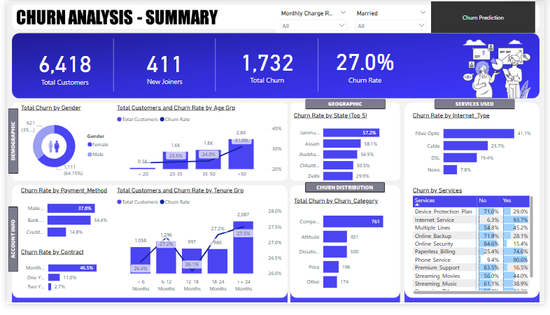
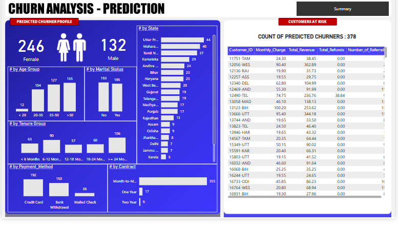

# 📉 Customer Churn Analysis & Prediction Pipeline (SQL + Power BI + Python)

### 🔍 Objective:
Build an end-to-end solution to analyze customer churn, identify churn drivers, and **predict future churners** using a robust pipeline consisting of:

- **SQL (ETL + Preprocessing)**
- **Power BI (Visualization + Insights)**
- **Python (ML-based Prediction)**

---

## 🎯 Business Goals:
- Visualize and analyze churn across demographics, accounts, payments, services, and geography  
- Identify key drivers contributing to customer churn  
- Predict future churners to enable early retention strategies

---

## 🧩 Architecture Overview

Raw CSV Data ➝ SQL Server (ETL & Staging) ➝ Power BI Dashboards
↘︎ ↘︎
Python ML Model Predictions (.csv) ➝ Power BI


---

## 🛠️ Tech Stack

| Tool | Purpose |
|------|---------|
| **SQL Server + SSMS** | ETL, staging, transformation, and views |
| **Power BI** | Data modeling, DAX measures, dashboards |
| **Python (scikit-learn, pandas, seaborn)** | ML model training (Random Forest), evaluation, prediction |

---

## 🚀 Key Features

✅ ETL pipeline in **SQL Server** with cleaned & enriched data  
✅ Deep-dive dashboards built using **Power BI** (Power Query + DAX)  
✅ **Random Forest** churn prediction model with 85% accuracy  
✅ **Predictive dashboard** for identifying customers likely to churn  
✅ Executive summary with filters: gender, contract, state, services

---

## 📊 Metrics Tracked

- Total Customers  
- Total Churn & Churn Rate  
- New Joiners  
- Churn by Age, State, Contract, Payment Method  
- Churn Categories & Reasons  
- Predicted Churn Count

---

## 📁 Project Structure

📦 churn-analysis-project/
│
├── SQL/
│ ├── create_database.sql
│ ├── etl_staging_to_prod.sql
│ ├── create_views.sql
│
├── PowerBI/
│ ├── ChurnDashboard.pbix
│ ├── Screenshots/
│ ├── SummaryPage.png
│ ├── PredictionPage.png
│
├── Python_Model/
│ ├── churn_prediction.ipynb
│ ├── prediction_data.xlsx
│ ├── predictions.csv
│
├── README.md


---

## 🧪 Step-by-Step Guide

### STEP 1: 📥 ETL with SQL Server

1. **Create DB & staging table**
```sql
CREATE DATABASE db_Churn;
Import CSV using SSMS Import Wizard
✅ Use VARCHAR(50) for all fields
✅ Add Customer_ID as Primary Key

Data Exploration & Cleaning

SELECT Gender, COUNT(*) FROM stg_Churn GROUP BY Gender;
SELECT SUM(CASE WHEN Gender IS NULL THEN 1 ELSE 0 END) FROM stg_Churn;

Load into Production Table

INSERT INTO prod_Churn
SELECT ..., ISNULL(Value_Deal, 'None') ...
FROM stg_Churn;
Create Views for Power BI


CREATE VIEW vw_ChurnData AS
SELECT * FROM prod_Churn WHERE Customer_Status IN ('Churned', 'Stayed');

CREATE VIEW vw_JoinData AS
SELECT * FROM prod_Churn WHERE Customer_Status = 'Joined';
STEP 2: 🧠 Power BI Transformation
Add calculated columns:

Churn Status = IF(Customer_Status = "Churned", 1, 0)

Monthly Charge Range, Age Group, Tenure Group

Create mapping tables:

mapping_AgeGrp, mapping_TenureGrp

prod_Services (unpivoted)

STEP 3: 📐 Power BI Measures
DAX
Total Customers = COUNT(prod_Churn[Customer_ID])

New Joiners = CALCULATE(COUNT(prod_Churn[Customer_ID]), prod_Churn[Customer_Status] = "Joined")

Total Churn = SUM(prod_Churn[Churn Status])

Churn Rate = [Total Churn] / [Total Customers]
STEP 4: 📊 Power BI Visuals
✅ Summary Page
Top Cards: Total Customers, Churn %, New Joiners

Demographic: Age, Gender

Account: Contract, Tenure, Payment

Services & Churn Reasons

✅ Churn Prediction Page
Predicted churn count by segment

Includes: State, Marital Status, Age Group, Contract Type

STEP 5: 🧠 Python - Random Forest Churn Prediction

from sklearn.ensemble import RandomForestClassifier
rf_model = RandomForestClassifier(n_estimators=100, random_state=42)
rf_model.fit(X_train, y_train)
Preprocessing:


LabelEncoder, train_test_split, drop columns
Evaluation:


from sklearn.metrics import classification_report, confusion_matrix
print(confusion_matrix(y_test, y_pred))
print(classification_report(y_test, y_pred))
Feature Importance:


sns.barplot(x=importances[indices], y=X.columns[indices])
Predict New Joiners:

original_data['Customer_Status_Predicted'] = rf_model.predict(new_data)
original_data.to_csv("Predictions.csv", index=False)
STEP 6: 📈 Visualize Predicted Churn in Power BI
Load Predictions.csv into Power BI

Use Measures:

DAX
Count Predicted Churner = COUNT(Predictions[Customer_ID])

Title Predicted Churners = "COUNT OF PREDICTED CHURNERS : " & COUNT(Predictions[Customer_ID])
📸 Screenshots
💼 Executive Dashboard

🔮 Churn Prediction View

💡 Impact
This solution enables:

✅ Proactive retention strategies

✅ Insightful segment-wise churn analysis

✅ Predictive visibility into customer behavior


🧠 Model Performance
Metric	Value
Accuracy	85%





